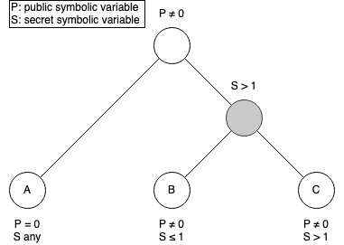
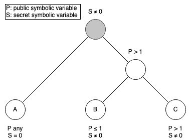

# `checkside` - A `checksec` for timing side channels

Gongqi Huang, ECE 580, 2023

## Introduction
`checkside` is a standalone program to check if the given binary executable
has timing variations that depend on the secret. The goal is to answer
the following questions: 1) given a binary, what information can we leak
through timing side channels 2) and how to leak it?

## Motivation
`checksec` [[1]](#1) is a binary analysis tool that checks security settings
given a target executable. Specifically, it checks whether the target executable
is Position Independent Executable (PIE), has Stack Canary, enables
Relocation Read-Only (RELRO), and so on. Although simple, the tool is very
useful especially at the beginning of a binary exploitation process, giving
a sense of what the target might be vulnerable to and where to begin the
exploitation. For example, if the target binary executable enables stack
canary but has a stack overflow bug, without actually looking into the code,
we know we must either attack the canary, implicitly hijack the control
flow, or change strategy and figure out another vulnerability to exploit.

Unfortunately, `checksec` doesn't provide much insight into whether the
target has timing side channels (i.e., constant time).
In this project, `checkside` aims to enable another security measurement
check as a complementary to `checksec` to determine if a given binary
has any information leakage through timing variations.

## Design
`checkside` checks if the target has any information
leak over timing channels through symbolic execution at the preliminary
state of a binary exploitation process.

Due to a lack of semantic information at the source
code level, two predefined timing and secrecy models are provided respectively
that users can choose a combination of them based on the use case of the
target binary executable. We expect users to have prior knowledge of the
purpose of the executable at a high level to select a model properly. We believe
this is a reasonable assumption because the knowledge can be obtained through
where the binary is downloaded from, a quick reverse engineering, and so on.

### Timing model
To detect timing variation, `checkside` must be able to reason about time
at ISA or IR level. Since it takes a binary executable as an input, we lose
higher level semantics about the program and thus cannot reason about time
at the language level. Furthermore, since QEMU does not emulate how many
cycles an instruction takes on real hardware, we cannot measure time in a
cycle-accurate manner, which essentially leaves two options: ISA and IR.
Since the target is a binary executable, its IR is essentially lifted from
the machine code, thus it doesn't contain higher level semantics about the
target. ISA, on the contrary, is a better choice because they are instructions
that a machine executes, and it can help reason about time because it is
directly related to the hardware.

A naive timing model is the number of instructions, which makes the assumption
that every instruction takes the same constant time. A weaker assumption
is that, however, each instruction takes some constant time. That is not true
either because not all instruction takes a constant time (i.e., load) and because
of Hertzbleed. But there are architectural supports [[2]](#2) for instructions
to take a data independent time. Without considering Hertzbleed, it is
a reasonable assumption.

### Secrecy model
As a binary analysis tool, no prior knowledge about the semantic information
of the target is known, which makes it hard to identify what the secret is.
However, the functionalities of the target may give us some hints. Imagine
a web server that communicates with a remote storage, the common practice is
to set the authentication key for the storage as an environment variable in
the local host. Therefore, the secrecy model of this kind of application is
that every standard input and network packets are public information,
while the environment variable is the secret.

Another type of secrecy model is that all standard input are secret. The
model maps to many other commonly used applications such as a screen locker
or a login authenticator.

Although I hope two models can apply to a wide range of applications, it is
likely for applications that use other secrecy models such as file system reads.
In `checkside`, users are allowed to write a customized secrecy model as a
plugin to fit into the scheme of the target binary executable.

### Three steps
The workflow of `checkside` consists of three steps: tracing, filtering,
and analysis.
1. Tracing gets traces of every possible execution path of the
target through symbolic execution.
2. Filtering removes irrelevant traces based on a secrecy model.
3. Analysis does the pairwise comparison among filtered traces
using a timing model.

**Tracking.**
Tracing symbolically executes the target binary executable to
get every ending state and its corresponding sequence of instructions
executed.

**Filtering.**
The job of filtering is to removes irrelevant traces base on a secrecy
model. It is OK to get rid of irrelevant traces because it is fine to
leak something that is not secret.

In `checkside`, filtering is an important step to get meaningful results
because anything from the outside of the target is treated as a symbolic
value, including ones that are considered to be non-secret. An intuitive
way of solving the problem is taint analysis such that any path
tainted is a meaningful path since it depends on the secret
explicitly or implicitly. Unfortunately, this approach requires
a two-round analysis (one for symbolic execution, another for
taint analysis).
Alternatively, taint analysis can be avoided. The key observation is that
symbolic execution a special form of taint analysis. More specifically,
if a state has previously depended on the secret symbolic variable either
explicitly or implicitly, the state must contains a constraint of that
symbolic variable. This is particularly useful because with it,
it is possible to check if two traces are *meaningfully comparable*
just by looking at constraints of their states.

When I say two traces are meaningfully comparable,
it means that both their execution paths are based on one same
condition that involves one or more secret variables but with
the opposite assumption of that condition. Thus, one can learn some knowledge
regarding the secret(s) from the comparison between two traces.



Considering a symbolic execution given in the above figure, $P$ and $S$
represent a public symbolic variable and a secret symbolic variable,
respectively. In addition, we care $S$ but not $P$ because $S$ contains
secret that we are unable to gain from explicit channels and
thus the goal, while anther one contains just public information. Meanwhile,
$A$, $B$, and $C$ are three ending states of the symbolic
execution "tainted" with path constraints.
Each corresponds with a unique trace of the execution path to it.
In the case above, only $(B, C)$ is a meaningfully comparable pair because
both corresponding traces depend on the same secret $S$. When we compare
$(A, B)$ or $(A, C)$, only the public information $P$ can be learned, which
is not useful.



Considering another case shown above, $(A, B)$ and $(A, C)$ are meaningfully
comparable pairs, while $(B, C)$ isn't for the same reason.

To figure out which pair of states is meaningfully comparable given
path constraints (or "taint labels"), I claim that a pair is meaningfully
comparable as long as constraints of at least one secret variable don't
overlap between two states.
Formally, given a
pair of state $(S_1, S_2)$ and a set of secret variables $V$,
suppose $C_{v1}$ and $C_{v2}$ are constraints of a secret variable $v \in V$
with states $S_1$ and $S_2$, respectively. Then,
$(S_1, S_2)$ is a meaningfully comparable pair given a set of secret
variables $V$ $\iff$
$\exists v \in V$ such that $C_{v1}, C_{v2} \vDash false$.

To prove the soundness, suppose $(S_1, S_2)$ is a meaningfully comparable
pair, by definition, $S_1$ and $S_2$ must diverge from at least one secret
variable $v$. In other words,
they must contain at least one non-overlapped constraint regarding $v$.
Thus, there exists such a secret variable $v$ such that
$(C_{v1} \land C_{v2}) \implies false$ is valid.
As for the completeness, suppose $\exists v \in V$
such that $C_{v1}, C_{v2} \vDash false$. There must
be a condition involving the secret variable $v$ to diverge two execution
paths leading to $S_1$ and $S_2$. Since $v \in V$, $(S_1, S_2)$ is a
meaningfully comparable pair given $V$.

**Analysis.**
The final step of `checkside` is to do the pairwise comparison among
traces obtained from the previous step. A timing model is used here to
tell that under what timing metrics, two states have a timing variation.

## Implementation
`checkside` is written in Python and uses `angr` as the symbolic execution
engine. I did not choose `KLEE` because it doesn't support binary analysis
and requires instruction at the source code level. `S2E` is not used because
it might separate the workflow into two parts (two binaries) and for
simplicity. Presumably, `S2E` is more efficient to analyze
large production software.

In the filtering step, whether two states are meaningfully comparable
is checked by determining the satisfiability of the conjunction
of two constraints of secret variables from two states. The conjunction
is solved through `Z3` solver which is the backing solver of `angr`.

Two timing models are implemented for the prototype. The first one simply
counts the number of instructions. The second one adds up the number of
core clock cycles of each instruction based on the instruction table
[[3]](#3) of Intel Skylake microarchitecture measured by Agner Fog.
Some instructions' execution time cannot be
meaningfully measured as they are memory related
(i.e., `mov eax, dword ptr [ebp-4]`) and thus is counted as 1 core
clock cycle.
Two secrecy models discussed in the design are implemented as well.
One is to take every standard input as secret. Another one treats
a user-definable environment variable as secret, while taking
everything else public.

The source code, examples, and instruction table of Intel Skylake
microarchitecture
are available at https://github.com/cherrypiejam/checkside.

## Case Study
### Leaky Checksum

```c
int leaky_checksum(char *data) {
    int sum = 0;
    for (int i = 0; i < strlen(data); i++) {
        sum += (int) data[i];
        sum %= 256;
    }
    return sum;
}
int main() {
    char data[8];
    fgets(data, sizeof(data), stdin);
    printf("%d", leaky_checksum(data));
}
```

```bash
# python checkside.py -p examples/build/leaky_checksum -m 1 \
#                     -t resources/intel_skylake_instruction_table_2022.csv
# pair 1
((b'\x00\x00\x00\x00\x00\x00\x00', 843)
,(b'\x01\x00\x00\x00\x00\x00\x00', 896))
# pair 2
((b'\x00\x00\x00\x00\x00\x00\x00', 843)
,(b'\x01\x01\x00\x00\x00\x00\x00', 949))
# ...
```

- Timing model: number of core clock cycles
- Secrecy model: standard input

The problem with this code is that its timing depends on the length
of the data obtained from standard input.
The result of `checkside` shows the number of instructions increases
as the length of standard input increases (the input ends with `\0`),
indicating a information leak from timing channels.

### Leaky Server

```c
int process(char *data) {
    const char* token = getenv("TOKEN");
    int sum = 0;
    for (int j = 0; j < 8; j++) {
        if (token[i] & 1 << j) {
            sum += (int) data[0];
        }
    }
    fprintf(fp, "%d", sum);
    return 0;
}
int main() {
    char data[1];
    fgets(data, sizeof(data), stdin);
    process(data);
}
```

```bash
# python checkside.py -p examples/build/leaky_server -m 2 -e TOKEN
# pair 1
({'envs': {'TOKEN': b'\xef'}, '# instructions': 429}
,{'envs': {'TOKEN': b'\xe7'}, '# instructions': 425})
# ...
```

- Timing model: number of instructions
- Secrecy model: The TOKEN environment variable

The problem of this code is that the execution time depends on the number
of 1s in the secret TOKEN. In pair 1 shown in the result, the first TOKEN
`\xef` has more 1s than the second TOKEN `\xe7` and thus cause more
instructions to be executed. In summary, the number of 1s of the secret
TOKEN can be learned.

*Both code can be found in the repository. They are a bit simplified
here for demonstration. The second case assumes the remote data is forwarded
to the standard input. I didn't try to recieve the data directly over the
network, but it makes no difference as long as angr can handle the network.*


## Limitation
The current implementation doesn't consider microarchitecture modeling because
QEMU isn't a microarchitectural emulator. Although this, there's a plugin in
QEMU to emulate behaviors of an ideal cache. The caveat is that given a target
binary executable, assuming the target instance is running on a different
hardware, one must figure out which microarchitectural platform the target
instance is using and thus emulate it. Although microarchitecture modeling is
not the focus of the project, `checkside` would be more useful with it.

Furthermore, the current version of `checkside` is slow and unable to handle
large software. This is because even if a trace is irrelevant
to all other traces, its path is
still executed during the first step, slowing down the performance. A possible
solution is to perform a static taint analysis and tell the symbolic execution
engine which path is irrelevant.
To boost the performance even more, another option is switching to `S2E` because
it allows us to selectively skip some library calls regarding the secrecy
model we pick, along with an additional performance benefit of C++.

Aside from the performance and accuracy, it is hard to take one step further
and yield a more useful and detailed result. For instance, the prototype
only tells you that there is a timing variation between two concrete values
of the secret. The result is certainly better than saying if there is any
timing channels existed in the binary, but a more useful result is to also
tell you a difference in which part of the secret can result in a timing
variation. An easy way is to output the constraints instead of the concrete
value of the secret. Unfortunately, constraints are hard to read and
will be complex when the program is large. In my option, the real challenge
here is how to visualize symbolic constraints.

## Conclusion
`checkside` checks whether a binary executable has timing variations
that depend on the secret or not. It could be useful to give a
preliminary picture of a binary target regarding its timing behaviors.
Specifically, it tells you what information can be leaked through
secrecy models and symbolic constraints and answers the how question
using timing models.
Unfortunately, the prototype cannot reason a program's timing variation
at the microarchitectural level in an accurate manner and requires
secrecy assumptions due to a lack of semantic information of the target.

## References
<a id="1">[1]</a>
checksec.sh. https://www.trapkit.de/tools/checksec/.

<a id="2">[2]</a>
Data independent timing. https://developer.arm.com/documentation/ddi0595/2021-06/AArch64-Registers/DIT--Data-Independent-Timing

<a id="3">[3]</a>
Instruction tables. https://www.agner.org/optimize/instruction_tables.pdf
